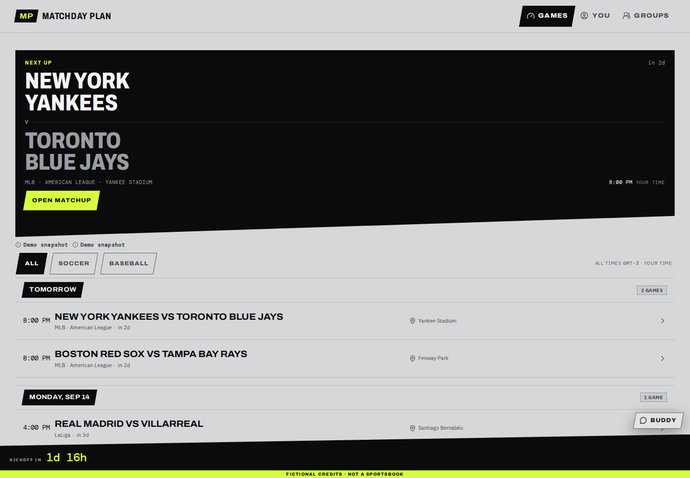
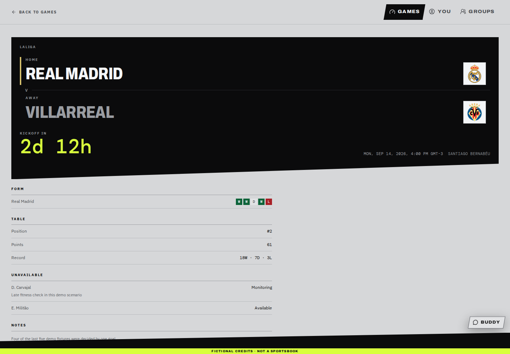
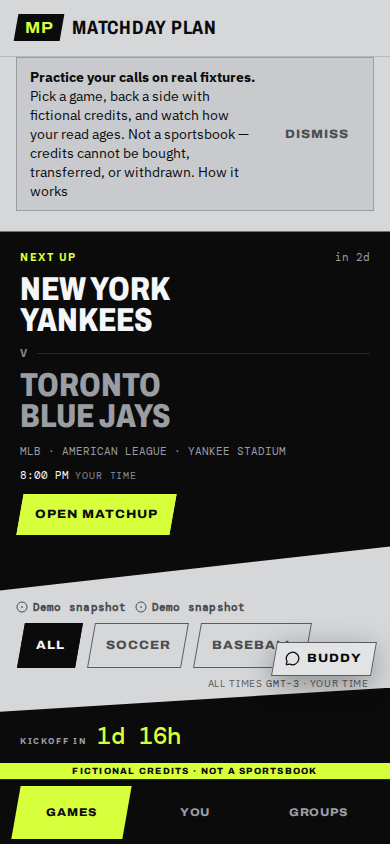

# Matchday Plan

Matchday Plan is a public sports preparation workspace for scanning upcoming games, reviewing source-backed context, generating cited AI briefings, keeping a browser-local watchlist, and saving recaps — without an account.

**Live demo:** [plan-bet.vercel.app](https://plan-bet.vercel.app)

Four tracked teams: Real Madrid, FC Barcelona, New York Yankees, and Boston Red Sox. Provider data is Zod-validated and normalized before it is stored or rendered, and every screen states whether what you are looking at is live, stale, or demo data.

| Dashboard                                      | Game detail                                        | Mobile                                             |
| ---------------------------------------------- | -------------------------------------------------- | -------------------------------------------------- |
|  |  |  |

_Captured from the production build in deterministic demo mode._

## Product surface

- Real Madrid and Barcelona schedules, La Liga standings, and recent form through football-data.org
- Yankees and Red Sox schedules, probable pitchers, standings, and Statcast expected batting through the MLB Stats API and Baseball Savant
- PostgreSQL-backed cache with explicit live / stale / demo freshness labels and a last-known-good fallback
- Grounded AI briefings: 5–7 items, each citing evidence facts from the game's own saved snapshot, degrading to a deterministic evidence brief when generation is unavailable or fails validation
- Browser-local watchlist CRUD, filters, recap notes, saved briefings, and activity totals
- `/system` operational view: provider freshness, ingestion history, briefing latency, fallback and retry rates
- Responsive, keyboard-accessible, screen-reader-tested desktop and mobile workspace

The preparation workspace needs no account; personal state never leaves the browser and lives in a single validated key, `matchday-plan:v1`. Signing in only unlocks the free-to-play credit ledger for the wager simulator — the rest of the workspace works signed out.

## Architecture

See [docs/architecture.md](./docs/architecture.md) for the data-flow diagram, the layering rule, the caching and fallback chain, evidence validation, quotas, observability, and the deliberate trade-offs.

## Stack

Next.js 16.2, React 19.2, TypeScript 6, Tailwind CSS 4, Zod 4, Zustand 5, PostgreSQL 18 on Neon, Drizzle ORM, the Neon serverless driver, the OpenAI Responses API with strict Structured Outputs, Vitest, Testcontainers, and Playwright. Exact versions are pinned in `package.json` and `pnpm-lock.yaml`; the project targets Node 24.18.1 and pnpm 11.

## Local setup

```bash
nvm use
corepack enable
pnpm install --frozen-lockfile
cp .env.example .env.local
pnpm db:migrate
pnpm db:seed
pnpm dev
```

Missing secrets do not break builds or navigation. Soccer falls back to demo data, briefings fall back to the deterministic evidence brief, and `/api/health` reports the unavailable dependency without exposing any configuration value.

### Environment variables

All are server-only except `NEXT_PUBLIC_SITE_URL`.

| Variable                  | Required           | Purpose                                                                                                        |
| ------------------------- | ------------------ | -------------------------------------------------------------------------------------------------------------- |
| `DATABASE_URL`            | for live data      | PostgreSQL connection string (single Neon branch)                                                              |
| `FOOTBALL_DATA_API_TOKEN` | for live soccer    | football-data.org token                                                                                        |
| `OPENAI_API_KEY`          | for AI briefings   | absent means briefings serve the deterministic fallback                                                        |
| `OPENAI_MODEL`            | no                 | defaults to `gpt-5.6-luna`                                                                                     |
| `BRIEFING_PROMPT_VERSION` | no                 | traceability stamp on every briefing run                                                                       |
| `BRIEFING_SCHEMA_VERSION` | no                 | traceability stamp on every briefing run                                                                       |
| `RATE_LIMIT_HASH_SECRET`  | in production      | salt for the anonymous IP quota hash; without it the salt is per-process and IP quotas reset on every redeploy |
| `CRON_SECRET`             | in production      | bearer secret for `/api/cron/refresh`; absent means the endpoint refuses to run                                |
| `MATCHDAY_DATA_MODE`      | no                 | set to `demo` for deterministic local and E2E runs                                                             |
| `NEXT_PUBLIC_SITE_URL`    | no                 | canonical origin for metadata; falls back to the Vercel production URL                                         |
| `AUTH_SECRET`             | for sign-in        | Auth.js signing secret; absent means sign-in is unavailable and the workspace runs anonymous exactly as before |
| `AUTH_URL`                | no                 | canonical origin Auth.js builds callback URLs from; unset is fine on Vercel                                    |
| `AUTH_GITHUB_ID`          | for GitHub sign-in | GitHub OAuth app client ID                                                                                     |
| `AUTH_GITHUB_SECRET`      | for GitHub sign-in | GitHub OAuth app client secret                                                                                 |
| `AUTH_GOOGLE_ID`          | for Google sign-in | Google OAuth client ID                                                                                         |
| `AUTH_GOOGLE_SECRET`      | for Google sign-in | Google OAuth client secret                                                                                     |

## Scripts

```bash
pnpm dev                      # development server
pnpm build && pnpm start      # production build
pnpm db:generate              # after editing src/db/schema.ts
pnpm db:migrate               # apply migrations
pnpm db:seed                  # idempotent team seed
pnpm data:refresh:soccer      # manual provider refresh (needs DATABASE_URL + real tokens)
pnpm data:refresh:baseball
pnpm smoke:briefing <routeId> # one live AI generation, exits non-zero unless it is live
```

## API

| Route                                | Purpose                                                                       |
| ------------------------------------ | ----------------------------------------------------------------------------- |
| `GET /api/teams`                     | The four configured canonical teams                                           |
| `GET /api/teams/:slug/games?limit=5` | Validated canonical schedule and team context                                 |
| `GET /api/games/:gameId`             | Canonical game snapshot, evidence facts, and source records                   |
| `POST /api/games/:gameId/briefings`  | Quota-limited grounded AI briefing, cited to the saved snapshot               |
| `GET /api/health`                    | App, database, schema currency, and provider status                           |
| `GET /api/system/recent?limit=10`    | Bounded recent ingestion and aggregate briefing metrics                       |
| `GET`/`POST /api/cron/refresh`       | Scheduled refresh, `Authorization: Bearer $CRON_SECRET`                       |
| `GET`/`POST /api/auth/*`             | Auth.js sign-in/callback routes; `503` when sign-in is unconfigured           |
| `GET /api/bets/summary`              | The signed-in account's credit ledger summary; `401`/`503` signed out         |
| `POST /api/bets/reset`               | Resets the signed-in account's bankroll to the starting balance, rate-limited |

Responses are `{ data }` or `{ error: { code, message, requestId } }`, always `Cache-Control: no-store`. Error messages never echo configuration.

## Data policy

Provider payloads are validated before normalization or persistence and are never rendered raw. Team metadata is cached for seven days, schedules and standings for six hours, and game snapshots for one hour. Reads prefer fresh live data, then expired last-known-good data labelled `stale`, then explicitly labelled demo data. Partial live schedules are never padded with fictional games, and missing data renders "Not provided" rather than being inferred.

Every AI briefing item cites evidence IDs present in that game's own stored snapshot. An item citing anything else is rejected before it reaches the reader.

## Quality gate

```bash
pnpm format:check
pnpm lint
pnpm typecheck
pnpm test
pnpm test:integration
pnpm build
pnpm test:e2e
```

Every one of these runs in CI on pull requests and on `main`, with no sports, OpenAI, or database credentials. `pnpm test:integration` starts and removes an isolated PostgreSQL 18 Docker container and never uses `DATABASE_URL`. Playwright starts the production build in deterministic demo mode on port 3100. CI additionally fails if `src/db/schema.ts` has drifted from the committed migrations.

## Current limitations

- Injury and player-availability information renders "Not provided" — no configured provider supplies it on a free tier.
- The four teams are fixed. Team slugs are a typed enum and provider IDs are per-adapter constants.
- Personal state is per browser. Nothing syncs across devices, and a returning visitor briefly sees the default team before their stored selection hydrates.
- Neither provider supplies a venue timezone, so times render in the reader's timezone with a UTC reference rather than the stadium's local time.
- No real-money betting, odds we compile ourselves, predictions, tipping, notifications, live play-by-play, or social features. The free-to-play wager simulator uses fictional, non-withdrawable credits; accounts and the credit ledger are live, and placing, locking, and settling a wager (Sessions 07–09) is still in progress.

## Attribution

Match data from [football-data.org](https://www.football-data.org/), the [MLB Stats API](https://statsapi.mlb.com/), and [Baseball Savant](https://baseballsavant.mlb.com/). Club crests and marks belong to their respective clubs.
