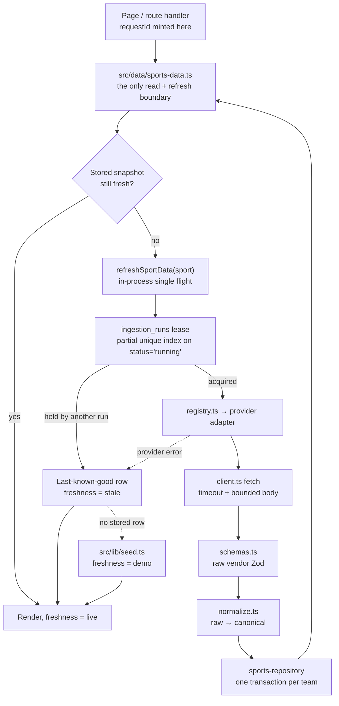

# Matchday Plan architecture

A no-login planning workspace for four teams (Real Madrid, FC Barcelona, New York Yankees, Boston Red Sox). Provider data is validated, normalized, cached in PostgreSQL, and rendered with an explicit freshness label. Personal state never leaves the browser.

## Layering

One direction only: **provider adapter → service → route/page**. UI and route handlers never import a provider's raw types.

`src/lib/contracts.ts` is the boundary. Everything crossing a layer is parsed through its Zod schemas. Sport context is a discriminated union on `kind`, so adding a sport forces exhaustive handling at every branch.

## Data flow

The fallback chain is strictly ordered: **fresh live snapshot → expired last-known-good (labelled `stale`) → seeded demo (labelled `demo`)**. A failed refresh never overwrites last-known-good: every write is an upsert inside a transaction, there is no `DELETE` anywhere in the repository layer, and each team persists independently so one team's failure cannot roll back another's.

## Adapters

`src/providers/<vendor>/` — `client.ts` (fetch, timeout, bounded response size, typed `ProviderError`), `schemas.ts` (raw vendor Zod), `normalize.ts` (raw → canonical), `provider.ts` (implements `SportsProvider`), `__fixtures__/` (sanitized payloads, so every test runs without network).

| Sport    | Adapters                       | Auth                      |
| -------- | ------------------------------ | ------------------------- |
| Soccer   | `football-data`                | `FOOTBALL_DATA_API_TOKEN` |
| Baseball | `mlb-stats`, `baseball-savant` | none                      |

`src/providers/registry.ts` maps `Sport` → provider. Callers branch on sport, never on vendor name. Adding a provider is a new directory plus a registry entry; no page changes.

Each provider holds its own ingestion lease (provider / operation / scope), enforced by a partial unique index on `status = 'running'`, so one provider's outage cannot block the other sport.

## Canonical snapshots and game identity

One stored game per provider game (`football-data-564645`, `mlb-{gamePk}`), associated with both tracked teams when both play. Public routes are team-perspective (`mlb-{gamePk}-new-york-yankees`), because the same fixture reads differently depending on which team you follow. Session 01 demo route IDs stay readable so existing browser-local links keep resolving.

## Caching and freshness

Freshness `mode` is **derived at read time** from the stored expiry (`src/data/cache-policy.ts`), never stored. A row that has aged out is still served — labelled `stale` — rather than discarded.

| Data                    | TTL       |
| ----------------------- | --------- |
| Team metadata           | 7 days    |
| Schedules and standings | 6 hours   |
| Game snapshots          | 1 hour    |
| Refresh lease           | 2 minutes |

Reads use the Neon HTTP driver. Multi-table writes use `withDatabaseTransaction`, which opens a Neon WebSocket pool and closes it in `finally`.

## Deterministic facts versus AI prose

Every assertable claim is a stored `EvidenceFact` with a stable ID, a source reference, and an observation time. The model never sees a raw timestamp: a `datetime` fact reaches it with the value withheld, and it writes a `{time}` token plus a `timestampEvidenceId` that the server resolves for browser-timezone rendering.

Generation pipeline (`src/data/briefings.ts`): claim a quota slot → build an allowlisted fact list (`briefing-prompt.ts`) → OpenAI Responses API with strict Structured Outputs, `tools: []`, `store: false` → validate → **exactly one** repair retry → deterministic fallback.

`src/lib/briefing-validation.ts` is pure and I/O-free. It rejects on `schema_invalid`, `unknown_evidence`, `item_count`, `duplicate_items`, `duplicate_categories`, `oversized_output`, `category_mismatch`, `prohibited_language`, and `date_in_prose`. A briefing item that cites an evidence ID absent from its own snapshot never reaches the reader.

Briefing `mode` (`demo | ai | fallback`) and freshness `mode` (`live | stale | demo`) are **separate axes** and are never merged in the UI.

## Anonymous quotas

Five generations per anonymous session per UTC day, twenty per IP hash per UTC day. Both are counted from `briefing_runs` inside one transaction guarded by `pg_advisory_xact_lock`, taken session-first then IP. No raw IP address, watchlist entry, or note is ever stored — only salted hashes and sanitized codes.

## Observability

| Surface                  | What it reports                                                                                                                                                      |
| ------------------------ | -------------------------------------------------------------------------------------------------------------------------------------------------------------------- |
| `GET /api/health`        | App, database connectivity, **schema currency** (detects an unapplied migration), provider configuration, last run and last success per provider, last AI generation |
| `GET /api/system/recent` | Bounded recent ingestion runs plus aggregate briefing metrics                                                                                                        |
| `/system`                | The same data, rendered                                                                                                                                              |

All application logs are single-line JSON via `src/lib/logger.ts`, carrying `timestamp`, `level`, `event`, and a `requestId` that is minted at the route or page boundary and threaded through provider, database, and AI operations. The logger redacts a key denylist and scrubs every configured secret's value out of any string before it is written.

Expected degradation logs at `warn`. An uncaught exception is a bug, not a fallback.

The schema-currency check in `/api/health` exists because a generated migration once went unapplied in production: `briefing_runs` did not exist, every audit write failed silently, and nothing surfaced it. CI catches the mirror-image problem — a schema edited without a generated migration — by running `pnpm db:generate` and failing if `drizzle/` becomes dirty.

## Accounts and the credit ledger

Auth.js 5 (`@auth/drizzle-adapter`) sits over the same Drizzle/Neon stack, entirely additive to the anonymous workspace: `isAuthConfigured()` (`src/lib/auth-config.ts`) is a pure `AUTH_SECRET` + database-configured predicate that health, the UI, and every gated route check _before_ calling `auth()`. Absent `AUTH_SECRET`, sign-in is unavailable and every other page renders exactly as it did before Session 06 — including staying statically rendered.

The credit balance is never a stored column. `credit_entries` is an append-only ledger (`grant` / `stake` / `return` / `reset`); `getCreditSummary` derives balance, lifetime staked/returned, net, and reset count as `SUM`/`COUNT` aggregates over a user's rows, the same way freshness is derived from stored expiry rather than a status flag. There is no update or delete path anywhere in application code — a bankroll reset inserts a new `reset` row (even at a zero delta) instead of editing anything.

The starting grant happens inside the same transaction as account creation (`withStartingGrant` wraps the adapter's `createUser`), so a user row can never exist without a grant row. The actual guarantee against a double grant under concurrency is a partial unique index, `credit_entries_user_grant_uidx` on `(user_id) where kind = 'grant'` — the same technique as `ingestion_runs_active_lease_uidx`. `resetBankroll` takes `pg_advisory_xact_lock(3, hashtext(user_id))` before counting recent resets against an hourly cap; advisory-lock classids 1 and 2 are already spoken for by the briefing session/IP quotas.

`requireAccount()` (`src/lib/auth.ts`) is the auth boundary every gated route and page goes through, returning `{ ok: false, reason: "unconfigured" | "unauthenticated" }` without ever calling `auth()` when Auth.js isn't configured. `POST /api/bets/reset` composes `isSameOrigin` → `requireAccount` → `readJsonBody` (`src/lib/api-request.ts`) before touching the database — the reference order for every mutating route Sessions 07–09 add.

## Scheduled refresh

`/api/cron/refresh` accepts `GET` (Vercel Cron issues GET) and `POST` (GitHub Actions), both requiring `Authorization: Bearer $CRON_SECRET` compared with `timingSafeEqual`. It refreshes both sports through `Promise.allSettled`, so one provider's failure cannot take down the other, and always answers 200 when authorized with a `succeeded / failed / skipped` summary — a scheduler should read the body, not retry-storm on a 5xx.

Vercel Hobby caps cron jobs at one invocation per day, so `vercel.json` schedules a daily run and `.github/workflows/refresh.yml` adds a six-hour cadence matching the schedule TTL.

## Deployment order

1. Apply migrations to production (`pnpm db:migrate`). **Before** deploying, never after.
2. Deploy a preview.
3. Smoke the preview: `PLAYWRIGHT_BASE_URL=<preview> pnpm test:e2e`.
4. With `OPENAI_API_KEY` set, generate one live briefing per sport: `pnpm smoke:briefing <route-id>`.
5. Confirm `/api/health` reports `database.schema: "current"`.
6. Promote, then tag.

`CRON_SECRET` and `RATE_LIMIT_HASH_SECRET` must be set in the hosting environment before the first cron fires. Without `RATE_LIMIT_HASH_SECRET` the IP hash falls back to a per-process salt, so IP quotas reset on every redeploy.

## Deliberate trade-offs

- **No authentication in the preparation workspace — only half true now.** Watchlists, recaps, saved briefings, and activity still live in one validated `localStorage` key, `matchday-plan:v1`, and require no account. Invalid or future-version data falls back to defaults instead of crashing, and nothing syncs across devices. Session 06 added an optional account, but only to back the credit ledger the wager simulator needs — no page in the preparation workspace itself is gated.
- **The dashboard ships all four teams' schedules.** Switching team is then instant with no server round-trip, at the cost of roughly four times the payload for one team displayed. The trade favours the interaction the page exists for.
- **First paint shows the default team.** The stored selection is only readable after hydration, so a returning visitor briefly sees Real Madrid before their team appears. Fixing it would require a cookie or a server read of browser-local state, which contradicts the browser-local-only rule.
- **Fixed teams.** Team slugs are a Zod enum and provider IDs are hard-coded per adapter. Arbitrary team selection would mean a team-search surface and unbounded provider quota use.
- **Free-tier providers.** football-data.org allows 10 requests per minute; no injury or player-availability feed is available at that tier, which is why availability renders "Not provided" rather than being inferred.
- **No real-money betting, odds we compile ourselves, predictions, or tipping.** A free-to-play wager simulator with fictional, non-withdrawable credits is planned as a separate milestone.
