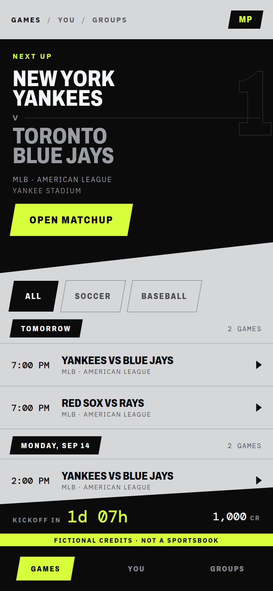
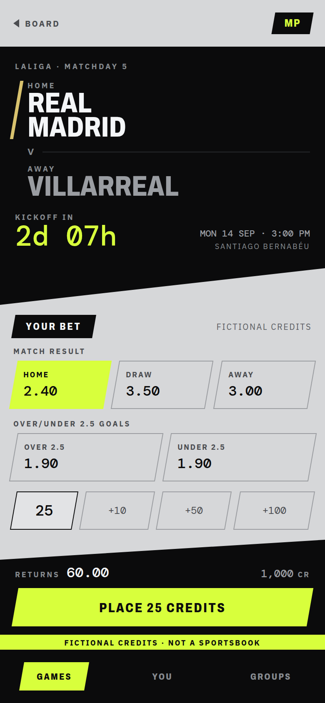

# Slant — design tokens

The palette, type and geometry contract for the Slant direction. This file is
the source of truth for _values_; `slant-migration.md` is the plan for _applying_
them. Read this one alone if you only need to know what a colour or a shear is.

Reference frames: [`slant-board.png`](./slant-board.png),
[`slant-matchup.png`](./slant-matchup.png) — both rendered at 390×844.
Canvas (all three concepts, Slant on the first page):
<https://claude.ai/code/artifact/f430b7ac-835e-4f2c-8e2e-7c826558e479>




## The direction in one paragraph

A light concrete ground, black ink, hard diagonal geometry and a single volt
accent — derived from the Nike _Bloed Oranje_ page. The app inverts: what was a
near-black broadcast scorebug becomes a printed board with black wedges cut into
it. Nothing is rounded, nothing glows, nothing has a gradient. Type is condensed
and shouted in the wedges, quiet and monospaced everywhere a figure appears.

## Three invariants

1. **Volt is a fill, never a foreground on the light ground.** `--volt` on
   `--concrete` is **1.25:1** — invisible. Volt may only appear as a
   `background` carrying `--volt-ink` text, or as a 2–4px rule. Volt _as text_
   is legal in exactly one place: inside an `--ink` surface, where it is
   17.13:1 — and that is where the countdown lives.
2. **The clock is the loudest thing on the page and the money is the
   quietest.** This survives from the current design unchanged. Countdowns and
   kickoff take volt inside ink; balances, stakes, prices and returns stay ink
   on concrete or chalk on ink. `--field` / `--clay` appear only on a settled
   outcome.
3. **Nothing is rounded.** Both radius tokens are `0`. The only circle left in
   the app is a decorative `border-radius: 50%` on `.empty-icon`.

## The `:root` block

Paste-ready. Replaces the current token block at the top of
`src/app/globals.css` in full. Every text colour carries its measured contrast
against the surface it is documented for; the ratios were computed with the
WCAG relative-luminance formula. TeamMark and its test were removed; browser axe checks validate rendered text.

```css
:root {
  /* ---------- ground and planes ---------- */
  /* Warm-neutral concrete, not blue-grey. The page, and the two planes that
     sit above and below it. */
  --concrete: #d6d7d9;
  --concrete-raised: #e2e3e5; /* an armed input, a lifted cell */
  --concrete-sunk: #c8cacd; /* filter bars, table heads */

  /* ---------- ink: text and black surfaces on the light ground ---------- */
  /* --ink flips meaning from the previous palette: it was the page ground,
     it is now the type and the wedges. Every comment left in globals.css that
     argues the opposite is stale — rewrite it, do not preserve it. */
  --ink: #0b0b0c; /* 13.66:1 on concrete */
  --ink-soft: #4b4d51; /*  5.88:1 on concrete, 5.16:1 on sunk */
  --ink-faint: #5a5c62; /*  4.64:1 on concrete */

  /* ---------- chalk: text reversed out of an ink surface ---------- */
  --chalk: #f4f6f8; /* 18.16:1 on ink */
  --chalk-soft: #9a9da2; /*  7.23:1 on ink */
  --chalk-faint: #878b90; /*  5.74:1 on ink */

  /* ---------- rules ---------- */
  --rule: #b7b9bd; /* hairline between rows */
  --rule-strong: #9b9da1; /* decorative separators; insufficient for control boundaries */
  --rule-ink: #26282b; /* a hairline inside an ink surface */

  /* ---------- accent ---------- */
  --volt: #d8ff3c;
  --volt-ink: #0b0b0c; /* 17.13:1 — the only text colour on volt */

  /* ---------- outcome ---------- */
  /* Two pairs: one legible on concrete, one legible inside an ink surface.
     Picking the wrong pair is the most likely way to fail the axe gate. */
  --field: #0d6339; /*  5.10:1 on concrete */
  --clay: #a81f26; /*  5.05:1 on concrete */
  --field-lit: #3ddc84; /* 11.03:1 on ink */
  --clay-lit: #ff5a5f; /*  6.45:1 on ink */

  /* ---------- semantic tones (status tags, banners) ---------- */
  --tone-positive-border: #9ccdb4;
  --tone-positive-bg: #dfeee7;
  --tone-positive-text: #0e5c38; /* 6.72:1 on its bg */
  --tone-warning-border: #c3d872;
  --tone-warning-bg: #f0f7cf;
  --tone-warning-text: #43520f; /* 7.71:1 on its bg */
  --tone-negative-border: #e0a4a6;
  --tone-negative-bg: #f8dede;
  --tone-negative-text: #8f1f24; /* 6.90:1 on its bg */

  /* ---------- geometry ---------- */
  --shear: -10deg; /* every sheared box; the sign matters */
  --unshear: 10deg; /* the counter-shear on the box's content */
  --wedge-drop: 44px; /* fall of a wedge's diagonal bottom edge */
  --ribbon-rise: 24px; /* rise of the ribbon's diagonal top edge */
  --nav-h: 4rem; /* initial estimate; measured on .app-shell */
  --ribbon-h: 5.25rem; /* initial estimate, never a fixed height */
  --tour-h: 0px; /* measured while visible */

  /* ---------- type ---------- */
  --font-body: "IBM Plex Sans Variable", system-ui, sans-serif;
  --font-display: "Archivo Variable", "Arial Narrow", sans-serif;
  --font-mono: "DM Mono", ui-monospace, "SF Mono", monospace;

  /* Archivo's width axis. Slant runs narrow: 78 for anything set large,
     108 for micro-caps labels. The previous design ran 112–118 throughout. */
  --wdth-cond: 78;
  --wdth-label: 108;

  --text-3xs: 0.5625rem; /* 9px — ribbon and plate micro-caps */
  --text-2xs: 0.65rem;
  --text-xs: 0.7rem;
  --text-sm: 0.76rem;
  --text-base: 0.85rem;
  --text-md: 1rem;
  --text-lg: 1.2rem;
  --text-xl: 1.5rem;
  --text-display: clamp(2rem, 8.5vw, 3rem); /* wedge team names */

  --weight-regular: 400;
  --weight-medium: 500;
  --weight-semibold: 600;
  --weight-bold: 700;
  --weight-black: 800; /* wedge names and plate labels */

  --space-1: 0.25rem;
  --space-2: 0.5rem;
  --space-3: 0.75rem;
  --space-4: 1rem;
  --space-5: 1.5rem;
  --space-6: 2rem;

  --radius-sm: 0;
  --radius-md: 0;

  --ease: cubic-bezier(0.23, 1, 0.32, 1);
  interpolate-size: allow-keywords;
}
```

`html` also flips: `background: var(--concrete)` and `color-scheme: light`.
`::selection` becomes `background: var(--ink); color: var(--chalk)` — a volt
selection band would put unreadable text under the cursor.

## Geometry: the three primitives

Slant adds exactly three shapes. Everything angled in both reference frames is
one of them.

### 1. The plate — a sheared control

Buttons, chips, day headings, the brand mark, the active nav item, selection
tiles. **Shear the box, counter-shear the content.**

```css
.plate {
  display: inline-flex;
  transform: skewX(var(--shear));
}
.plate > * {
  display: flex;
  transform: skewX(var(--unshear));
}
```

> **`clip-path` is the wrong tool here and fails silently.** The first pass used
> `clip-path: polygon(11px 0, 100% 0, calc(100% - 11px) 100%, 0 100%)` and every
> outlined control rendered with its left and right borders shaved off — prices
> in frames with only a top and a bottom. `clip-path` clips the border box;
> `skewX` transforms it, so the border shears with the plate. Use `clip-path`
> only for the wedge and the ribbon, which are borderless.

A centered sheared box overflows its layout width by `height × tan(10°) / 2` on each
side — about 5px on a 56px tile. Budget at least 8px of `gap` between adjacent
plates in a grid or they visually collide.

### 2. The wedge — an ink block with a diagonal bottom edge

The board hero and the matchup scorebug. Borderless, so `clip-path` is correct.

```css
.wedge {
  background: var(--ink);
  color: var(--chalk);
  clip-path: polygon(0 0, 100% 0, 100% calc(100% - var(--wedge-drop)), 0 100%);
}
```

The drop is dead space: the wedge's own height must be its content height
**plus** `--wedge-drop`, or the last line of content sits in the cut. This is
what broke the first board frame, where the CTA landed on top of the venue.

### 3. The ribbon — the bottom band, diagonal top edge

On mobile, its own grid row above navigation; on desktop, fixed at the bottom.
Carries the board countdown or matchup returns, account control, action and
announced feedback. It grows with content; there is no fixed ribbon height.

```css
.ribbon {
  background: var(--ink);
  color: var(--chalk);
  clip-path: polygon(0 var(--ribbon-rise), 100% 0, 100% 100%, 0 100%);
}
```

The rise is padding inside the ribbon, above all content. The mobile scroller
ends at the ribbon's box; desktop content reserves its measured height. The ribbon closes with an
18px volt strip carrying `Fictional credits · Not a sportsbook` — the one place
the free-to-play framing is guaranteed visible without scrolling.

## Type in practice

| Where                           | Face    | Size                    | Width | Weight                |
| ------------------------------- | ------- | ----------------------- | ----- | --------------------- |
| Wedge team name                 | display | `--text-display`        | 78    | 800                   |
| Countdown, big                  | mono    | 34px                    | —     | 500                   |
| Plate label (button, chip, nav) | display | `--text-xs`–`--text-sm` | 108   | 800                   |
| Panel / day heading             | display | `--text-base`           | 108   | 800                   |
| Eyebrow, micro-caps             | body    | `--text-3xs`            | —     | 700, `0.2em` tracking |
| Row title                       | display | `--text-md`             | 78    | 800                   |
| Body copy                       | body    | `--text-base`           | —     | 400                   |
| Any figure                      | mono    | —                       | —     | 500, `tabular-nums`   |

Uppercase everything set in the display face. Never uppercase body copy.

## Token migration table

| Old                           | Old value          | New                             | New value             | Note                                                                  |
| ----------------------------- | ------------------ | ------------------------------- | --------------------- | --------------------------------------------------------------------- |
| `--ink`                       | `#08090b` (ground) | `--ink`                         | `#0b0b0c` (text)      | **Meaning flips.**                                                    |
| `--slat`                      | `#101318`          | `--concrete`                    | `#d6d7d9`             | The page ground.                                                      |
| `--slat-raised`               | `#171b21`          | `--concrete-raised`             | `#e2e3e5`             |                                                                       |
| `--slat-muted`                | `#08090b`          | `--concrete-sunk`               | `#c8cacd`             |                                                                       |
| `--rule`                      | `#23282f`          | `--rule`                        | `#b7b9bd`             |                                                                       |
| `--rule-strong`               | `#333a44`          | `--rule-strong`                 | `#9b9da1`             |                                                                       |
| —                             | —                  | `--rule-ink`                    | `#26282b`             | New: hairline inside a wedge.                                         |
| `--chalk`                     | `#f4f6f8`          | `--chalk`                       | `#f4f6f8`             | Unchanged, but now only legal inside ink.                             |
| `--muted`                     | `#98a1ae`          | `--ink-soft` / `--chalk-soft`   | `#4b4d51` / `#9a9da2` | **Splits in two** by surface.                                         |
| `--faint`                     | `#7f8896`          | `--ink-faint` / `--chalk-faint` | `#5a5c62` / `#878b90` | **Splits in two** by surface.                                         |
| `--sodium`                    | `#d8ff3c`          | `--volt`                        | `#d8ff3c`             | Same hue, honest name, fill-only rule.                                |
| `--sodium-dark`               | `#1b2408`          | `--volt-ink`                    | `#0b0b0c`             | Text on a volt plate.                                                 |
| `--field`                     | `#3ddc84`          | `--field` / `--field-lit`       | `#0d6339` / `#3ddc84` | **Splits in two** by surface.                                         |
| `--clay`                      | `#ff5a5f`          | `--clay` / `--clay-lit`         | `#a81f26` / `#ff5a5f` | **Splits in two** by surface.                                         |
| `--field-dark`, `--clay-dark` | —                  | —                               | —                     | Deleted; the tone triples cover them.                                 |
| tone `*-border/bg/text`       | dark six           | same names                      | light six             | Values above.                                                         |
| `--radius-sm`                 | `2px`              | `--radius-sm`                   | `0`                   |                                                                       |
| type/weight/space scales      | —                  | same names                      | mostly same           | `--text-3xs` and `--weight-black` added; `--text-display` re-clamped. |

The four token families that **split by surface** are the ones to be careful with: at
every call site, decide whether the text sits on concrete or inside a wedge or
ribbon, and pick accordingly. Getting it wrong is a contrast failure, and
`e2e/accessibility.spec.ts` will catch it.

## Where each token may appear

| Token                        | Allowed                                                           | Never                              |
| ---------------------------- | ----------------------------------------------------------------- | ---------------------------------- |
| `--volt`                     | `background` of a plate; a 2–4px rule; text inside an ink surface | text on concrete; any money figure |
| `--volt-ink`                 | text on a volt plate                                              | anywhere else                      |
| `--ink`                      | body text; wedge/ribbon/nav/plate fill                            | as a page ground                   |
| `--chalk*`                   | text inside ink                                                   | text on concrete                   |
| `--ink-soft`                 | secondary text on concrete, raised or sunk                        | inside a wedge                     |
| `--ink-faint`                | tertiary text on concrete or raised                               | on sunk; inside a wedge            |
| `--field` / `--clay`         | a settled outcome on concrete                                     | an open wager; any live clock      |
| `--field-lit` / `--clay-lit` | a settled outcome inside a wedge or ribbon                        | on concrete                        |
| `--concrete-raised`          | an armed input, a hovered row                                     | a whole panel                      |

## Club colours are not tokens

`team.colors.primary` in `src/lib/seed.ts` is canonical data and does not
change. It has one use: the 4px stripe on the tracked side of the scorebug
(`--mp-club`, set inline by `src/components/matchup/scorebug.tsx`). Inside the
ink wedge, Real Madrid `#d8c26e` is 11.11:1 and the Yankees' `#a7b4c8` is
9.37:1; Barcelona's `#a8274c` is the weakest at 2.87:1. It is a decorative
stripe, not text — widen it rather than touching the seed value.

## Control contrast and movement

`--rule` and `--rule-strong` are decorative separators, not sufficient control
boundaries. Use `--ink-faint` for unselected tiles and inputs, `--ink` for the
selected tile boundary. The selected tile also exposes `aria-pressed`. Use a
2px ink focus ring on concrete and a chalk ring inside ink, with room for the
offset. Inputs stay upright. `Button asChild` retains the link/control as the
slot child and wraps only its content.

Compose press movement: `translateY(1px) skewX(var(--plate-shear, 0deg))`.
Ghost buttons set that shear to zero. Preserve animation timing and reduced
motion; counter-skewed content does not animate independently.

Reference balances, names, times, prices and stake increments are illustrative.
Render actual application data and the existing +5 / +25 / max controls.
